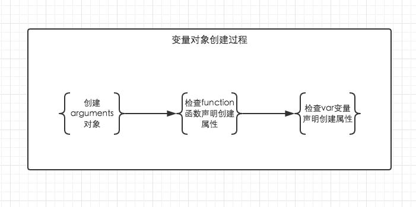

当调用一个函数时（激活），一个新的执行上下文就会被创建。而一个执行上下文的生命周期可以分为两个阶段。

- 创建阶段
在这个阶段中，执行上下文会分别创建变量对象，建立作用域链，以及确定this的指向。

- 代码执行阶段
创建完成之后，就会开始执行代码，这个时候，会完成变量赋值，函数引用，以及执行其他代码。

## 变量对象

变量对象的创建，依次经历了以下几个过程。

1. 建立arguments对象。检查当前上下文中的参数，建立该对象下的属性与属性值。

2. 检查当前上下文的函数声明，也就是使用function关键字声明的函数。在变量对象中以函数名建立一个属性，属性值为指向该函数所在内存地址的引用。如果函数名的属性已经存在，那么该属性将会被新的引用所覆盖。

3. 检查当前上下文中的变量声明，每找到一个变量声明，就在变量对象中以变量名建立一个属性，属性值为undefined。如果该变量名的属性已经存在，为了防止同名的函数被修改为undefined，则会直接跳过，原属性值不会被修改。


```
function foo() { console.log('function foo') }
var foo = 20;
console.log(foo); // 20
```
上面的三条规则仅仅适用于变量对象的创建过程。也就是执行上下文的创建过程。而foo = 20是在执行上下文的执行过程中运行的，输出结果自然会是20。对比下例。
```
console.log(foo); // function foo
var foo = 20;
function foo() { console.log('function foo') }
```

```
// 上栗的执行顺序为

// 首先将所有函数声明放入变量对象中
function foo() { console.log('function foo') }

// 其次将所有变量声明放入变量对象中，但是因为foo已经存在同名函数，因此此时会跳过undefined的赋值
// var foo = undefined;

// 然后开始执行阶段代码的执行
console.log(foo); // function foo
foo = 20;
```

## JavaScript 变量提升

- JavaScript 中，函数及变量的声明都将被提升到函数的最顶部。

JavaScript 中，变量可以在使用后声明，也就是变量可以先使用再声明。

- JavaScript 初始化不会提升

JavaScript 只有声明的变量会提升，初始化的不会。

```
var x = 5; // 初始化 x
elem = document.getElementById("demo"); // 查找元素
elem.innerHTML = x + " " + y;           // x 为：5，y 为：undefined
var y = 7; // 初始化 y
```