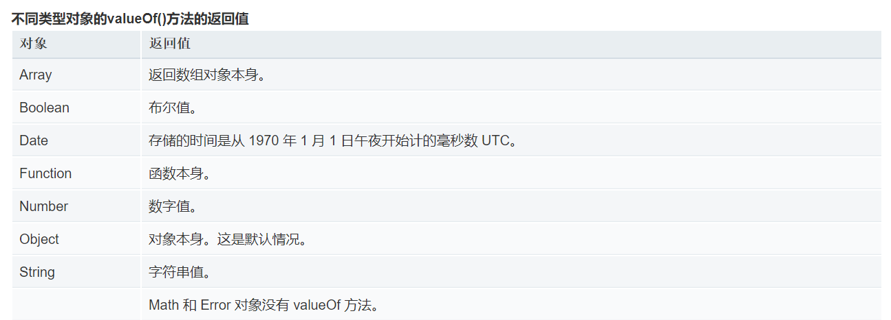
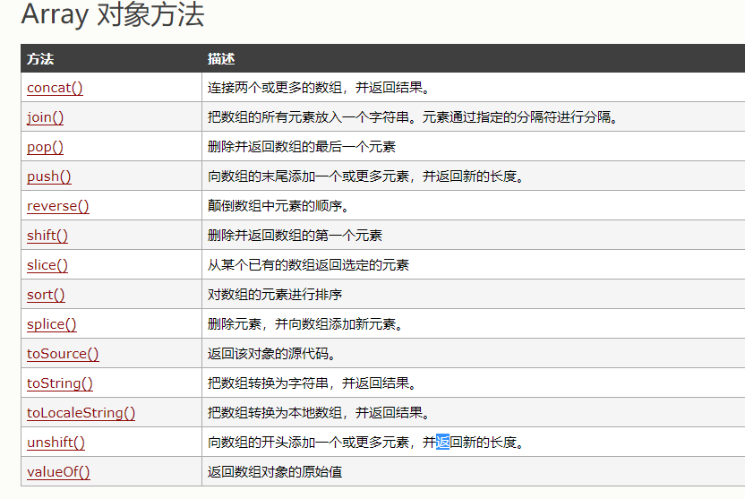
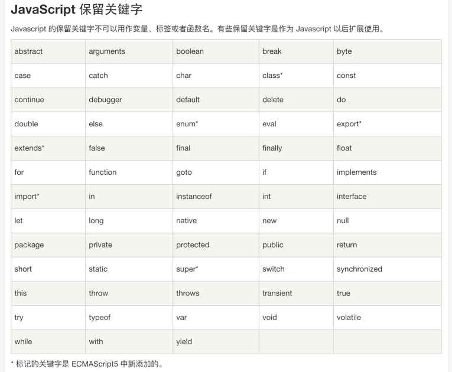
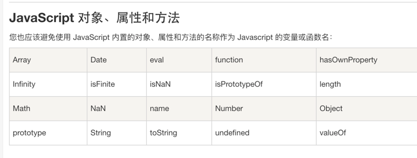

# 常用函数

## forEach()

forEach方法在数组元素为空时会跳过执行回调函数

## valueOf()



## jquery

text()设置或返回被选元素的文本内容
：contains选择器，选取包含指定字符串的元素，字符串也可以是文本
:input()选择器，选取表单元素
attr(name,value)属性操作，设置或返回被选元素的属性和属性值

## toString()

2.toString()将会优先将小数点解析为数字小数点
2..toString()因为连续的两个小数点不符合number的格式规则，第二个小数点才会被解析为调用方法

## history

history.back() 方法加载历史列表中前一个 URL。 这等同于在浏览器中点击后退按钮。

window.history.go(-1);// 向后移动一个页面 (等同于调用 back()):

window.history.go(1);// 向前移动一个页面, 等同于调用了 forward():

## Array



## void

- 立即调用的函数表达式
- JavaScript URIs
- 在箭头函数中避免泄漏

## append

1. append(content)方法

方法作用：向每个匹配的元素内部追加内容。

参数介绍：content (<Content>): 要追加到目标中的内容。

用法示例：

```html
<p>I come from </p><p>I love  </p>

$("p").append("china"); //向所有p标签中追加一个单词china

//结果为：<p>I come from china</p><p>I love china </p>
```

2. appendTo(expr)方法

方法作用：把所有匹配的元素追加到指定的元素元素集合中。

参数介绍：expr (String): 用于匹配元素的jQuery表达式。

用法示例：

```html
<b>I love china </b><p></p>

$("b").appendTo("p");//把标签b追加到p元素中

//结果为：><p><b>I love china </b></p>
```

使用appendTo这个方法是颠倒了常规的$(A).append(B)的操作，即不是把B追加到A中，而是把A追加到B中。

## innerHTML

- test.innerHTML:
从对象的起始位置到终止位置的全部内容,包括Html标签。

- test.innerText:
从起始位置到终止位置的内容, 但它去除Html标签

- test.outerHTML:
除了包含innerHTML的全部内容外, 还包含对象标签本身。

上例中的text.outerHTML的值也就是<div id="test"><span style="color:red">test1</span> test2</div>

## 关键字





## attachEvent

 1.attachEvent与addEventListener的区别

- 支持的浏览器不同。attachEvent在IE9以下的版本中受到支持。其它的都支持addEventListener。
- 参数不同。addEventListener第三个参数可以指定是否捕获，而attachEvent不支持捕获。
- 事件名不同。attachEvent第一个参数事件名前要加on，比如el.attachEvent('onclick', handleClick)。
- this不同。attachEvent的this总是Window。addEventListener的this总是当前正在处理事件的那个DOM对象。

attachEvent中的this总是指向全局对象Window

## call apply

call和apply的作用都是改变this作用域，都是在特定作用域中调用函数。当一个对象没有某个方法，而其他对象有，我们就可以使用call或apply实现某个方法的复用。

- apply

区别仅在于传入参数的形式的不同。

apply 接受两个参数,第一个参数指定了函数体内 this 对象的指向,

第二个参数为一个带下标的集合,这个集合可以为数组,也可以为类数组,apply 方法把这个集合中的元素作为参数传递给被调用的函数

```js
var func = function( a, b, c ){ 
    console.log([a,b,c]); //输出:[1,2,3]
};
func.apply( null, [ 1, 2, 3 ] );
```

- call

call 传入的参数数量不固定, 跟apply 相同的是,第一个参数也是代表函数体内的 this 指向, 从第二个参数开始往后,每个参数被依次传入函数

```js
var func = function( a, b, c ){

    console.log([a,b,c]); //输出:[1,2,3]
};
func.call( null, 1, 2, 3 );
```

## select option

```html
<select id="mySelect">
<option value="1">one</option>
<option value="2">two</option>
<option value="3">three</option>
</select>
```

通过以下script代码来获取选中的value和text

```js
$("#mySelect").val(); //获取选中记录的value值
$("#mySelect option:selected").text(); //获取选中记录的text值

```

2、运用new Option("文本","值")方法添加选项option

var obj = document.getElementById("mySelect");
obj.add(new Option("4","4")); 

3、删除所有选项option

var obj = document.getElementById("mySelect");
obj.options.length = 0; 

4、删除选中选项option

var obj = document.getElementById("mySelect");
var index = obj.selectedIndex;
obj.options.remove(index);

5、修改选中选项option

var obj = document.getElementById("mySelect");
var index = obj.selectedIndex;
obj.options[index] = new Option("three",3); //更改对应的值
obj.options[index].selected = true; //保持选中状态

6、删除select

var obj = document.getElementById("mySelect");
obj.parentNode.removeChild(obj); //移除当前对象 

7、select选择的响应事件

$("#mySelect").change(function(){ //添加所需要执行的操作代码}) 

## setTimeout

```js
function checkState(){
 alert("liyuming");
 }
 window.setTimeout(checkState(), 10000); //立即被调用

window.setTimeout(checkState, 10000); // 10s后被调用
window.setTimeout("checkState()", 10000); //10s后被调用 注意和第一个的区别 有引号
```

## 全局函数


## 字符串连接

+的处理机制是：新建一个临时字符串，将新字符串赋值为a+b，然后返回这个临新字符串并同时销毁原始字符串，所以字符串连接效率较低。所以用Array.join()不会新建临时字符串效率更高。

## parseInt()

parseInt(string, radix)   将一个字符串 string 转换为 radix 进制的整数， radix 为介于2-36之间的数。

